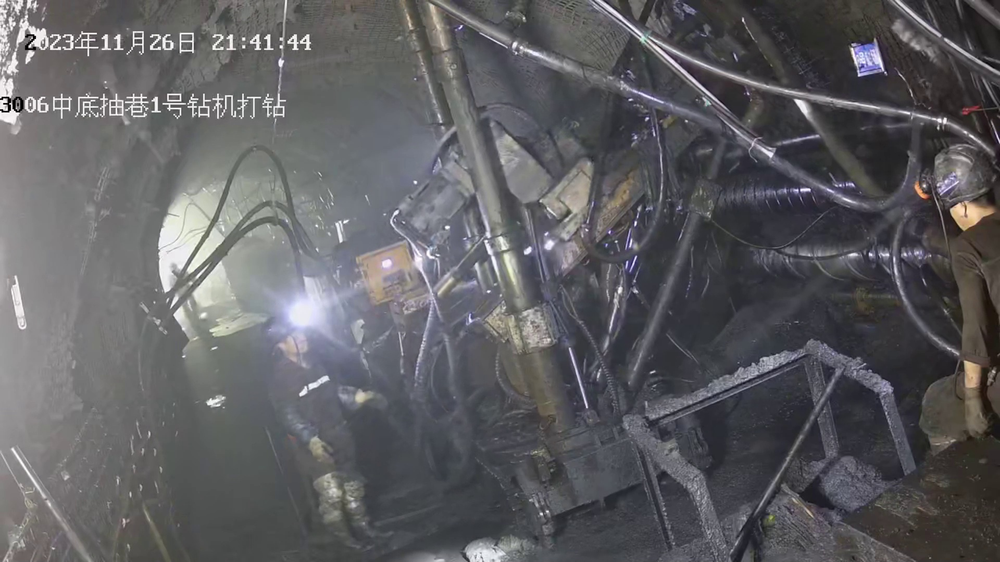
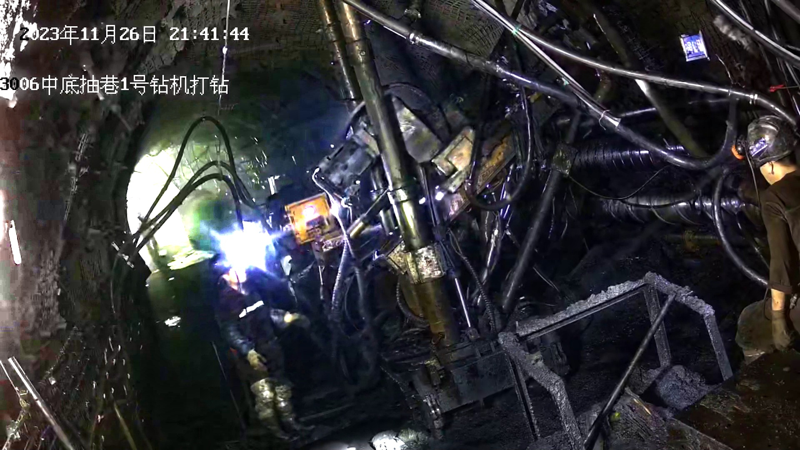

# Multi-Module Enhanced Human Pose Detection for Low-Illumination Coal Mine Environments
This is the official open-source repository for the paper submitted to *The Visual Computer*. It provides a complete, reproducible pipeline for **data preprocessing, model training, inference evaluation, and multi-platform deployment**, ensuring that researchers can replicate our experiments and validate results with minimal effort.

---

## 🖥️ Experimental Environment
| Environmental items | Configuration value |
|---------------------|----------------------|
| Operating system    | Ubuntu               |
| Programming language| Python 3.8           |
| GPU                 | NVIDIA GeForce RTX 4070 12GB |
| CPU                 | Intel(R) Core(TM) i5-14600KF |
| Memory              | 32 GB                |
| Deep learning framework | PyTorch 2.1.0    |
| CUDA Version        | CUDA 12.1            |

---

## 📂 Repository Structure
```text
├── dataset/                # Dataset directory (organized in YOLO format)
├── docker/                 # Docker environment configuration
├── docs/                   # Supplementary documentation and guides
├── examples/               # Usage demos
├── images/                 # Test images and visualization results
├── tests/                  # Environment verification and unit tests
├── ultralytics/            # Modified YOLOv11 core source code
├── .gitignore              # Ignore cache and unnecessary files
├── LICENSE                 # MIT License
├── README.md               # English documentation
├── README.zh-CN.md         # Chinese documentation
├── train.py                # Main training script
├── val.py                  # Model evaluation script
├── detect.py               # Inference/detection script
├── export.py               # Model export script (ONNX/TensorRT, etc.)
├── transform_PGI.py        # Data preprocessing and augmentation code
├── requirements.txt        # Environmental dependency file
└── test_env.py             # Environment dependency verification


### 1. Native Installation
```bash
git clone https://github.com/v1smile/coal-mine-pose-detection.git
cd coal-mine-pose-detection

conda create -n coal-pose python=3.8 -y
conda activate coal-pose

pip install torch==2.1.0 torchvision==0.16.0 torchaudio==2.1.2 --index-url https://download.pytorch.org/whl/cu121
pip install ultralytics opencv-python matplotlib pandas pycocotools

### 2. Docker Installation (Recommended for Reproducibility)
```bash
cd docker
docker build -t coal-pose-det:v1 .
docker run -it --gpus all coal-pose-det:v1

### 3. Verify Environment
```bash
python test_env.py

All checks passing indicates the environment is ready.

## 📊 Dataset Preparation & Preprocessing
1.Arrange datasets in standard YOLO format:
dataset/
```text
├── train/images
├── train/labels
├── val/images
├── val/labels
└── test/images

2.Execute data enhancement and low-light image preprocessing:
```bash
python transform_PGI.py

## 📊 Experimental Results & Visualization
### Qualitative Comparison Results


### Low-Illumination Enhancement Effect


3.Convert annotation formats via built-in conversion scripts to match network input standards.

## 🧠 Core Algorithm Overview
Based on YOLOv11n-Pose baseline, four practical optimized modules are embedded to adapt complex underground coal mine environments with low illumination, dust and occlusion interference:
1. PENet: Low-light image enhancement module to improve overall image quality
2. StarNet: Lightweight backbone network to reduce model parameters and computation cost
3. ODConv: Dynamic convolution module to strengthen multi-scale feature extraction ability
4. DAttention: Adaptive attention mechanism to focus on human body key pose areas

All improved modules are completely open-sourced and embedded in the network structure with clear code annotations.


## 🚀 Training & Validation
### Training
```bash
python train.py --cfg your_model.yaml --data coal_mine.yaml --epochs 200 --batch 8
--cfg: Custom network configuration file path
--data: Dataset configuration file path
--epochs: Total training epochs
--batch: Batch size

### Resume interrupted training
```bash
python train.py --resume runs/train/exp/weights/last.pt

### Validation
```bash
python val.py --weights best.pt --data coal_mine.yaml

Automatically calculate mAP, precision, recall and other quantitative indicators, and output standard evaluation results consistent with paper experimental data.

## 🔍 Inference & Visualization
Single image inference:
```bash
python detect.py --weights best.pt --source test.jpg --conf 0.25

Batch image and video inference are supported. 


## 📦 Model Deployment
Supports one-click export of multiple deployment formats for actual engineering application:

```bash
python export.py --weights best.pt --include onnx
python export.py --weights best.pt --include engine

Deployment tutorials for embedded devices and server platforms are placed in the docs/ folder.


## 📄 Citation & DOI
If you find this work useful, please cite our paper:
```bibtex
@article{yourpaper,
  title={Multi-Module Enhanced Human Pose Detection for Low-Illumination Coal Mine Environments},
  author={[Your Authors]},
  journal={The Visual Computer},
  year={2026},
  doi={}
}

This repository is archived on Zenodo with DOI: [your-doi-here].

## 📜 License
This project is open source under the MIT License, free for academic research use.

## 📧 Contact
For experimental reproduction problems and academic communication, please submit issues or contact the author by email.


